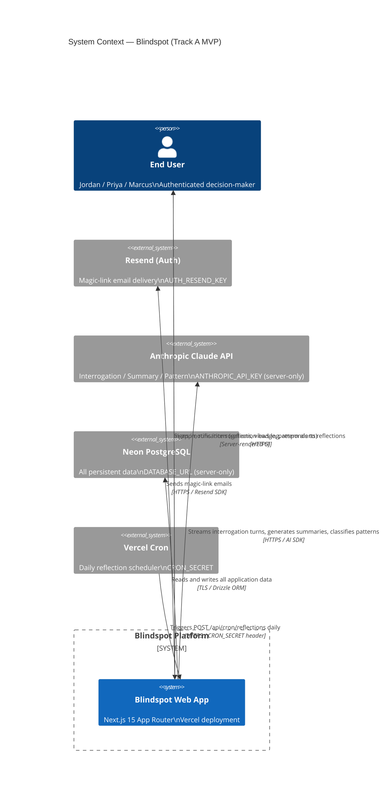
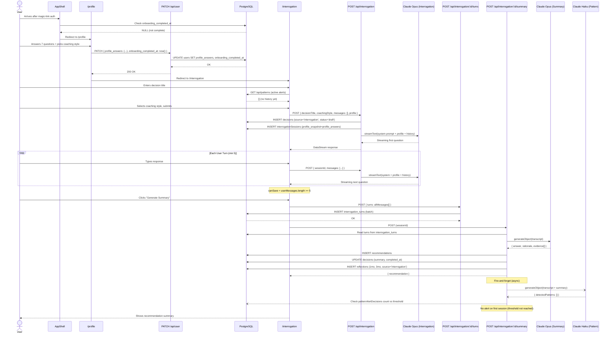
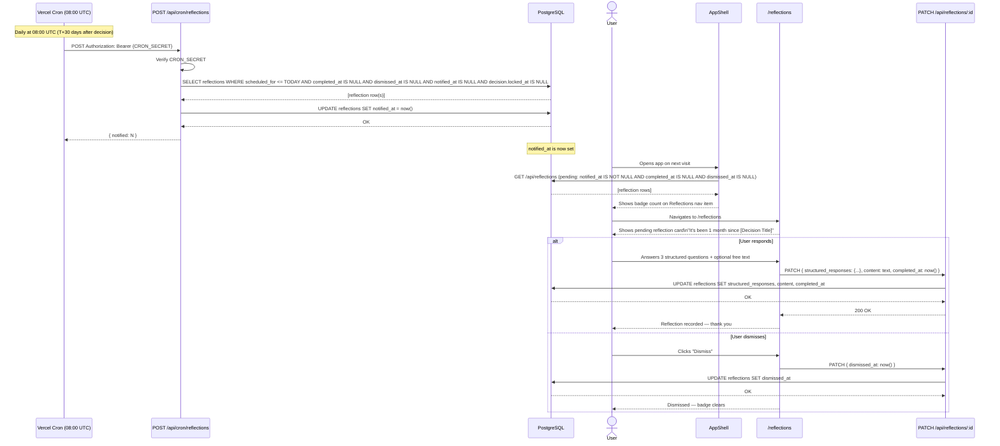
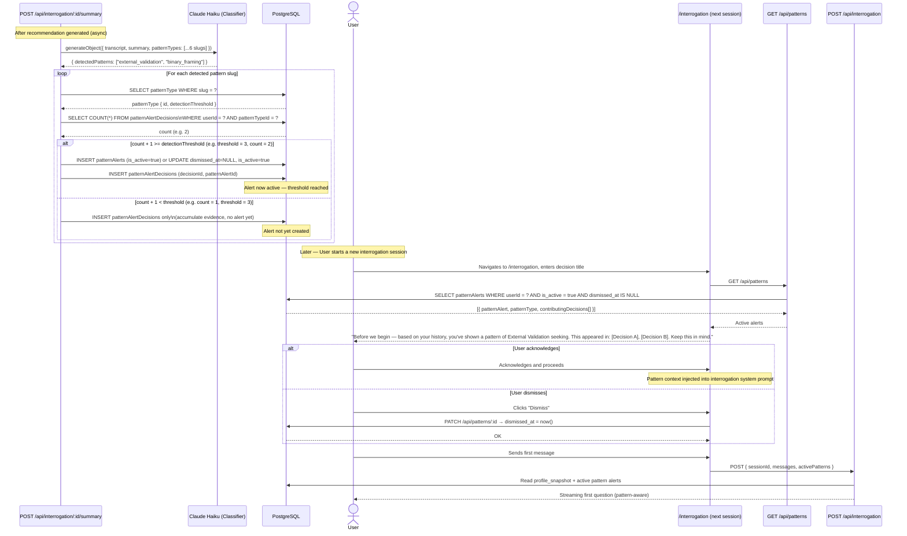

# Blindspot — Pass 2 Solution Definition

**Document version:** 2.0  
**Date:** 2026-07-16  
**Author:** Solution Architecture Review  
**Status:** Final — approved for Pass 3 backlog creation  
**Preceding document:** `docs/analysis/pass-1-document-analysis.md`

---

## Table of Contents

1. [Executive Summary](#1-executive-summary)
2. [Pass 1 Correction Log](#2-pass-1-correction-log)
3. [Delivery Tracks and Decision Gates](#3-delivery-tracks-and-decision-gates)
4. [Confirmed Scope and Exclusions](#4-confirmed-scope-and-exclusions)
5. [System Context](#5-system-context)
6. [Logical Architecture](#6-logical-architecture)
7. [Computation and Authority Boundaries](#7-computation-and-authority-boundaries)
8. [End-to-End Workflows](#8-end-to-end-workflows)
9. [Integration Contracts](#9-integration-contracts)
10. [Data Architecture and ERD Reconciliation](#10-data-architecture-and-erd-reconciliation)
11. [Security, Privacy, and Trust Boundaries](#11-security-privacy-and-trust-boundaries)
12. [Non-Functional Requirements](#12-non-functional-requirements)
13. [Environment and Deployment Model](#13-environment-and-deployment-model)
14. [Observability](#14-observability)
15. [Testing Strategy](#15-testing-strategy)
16. [Architecture Decision Records](#16-architecture-decision-records)
17. [Solution Traceability Matrix](#17-solution-traceability-matrix)
18. [Risks, Assumptions, and Open Decisions](#18-risks-assumptions-and-open-decisions)
19. [Readiness Assessment for Pass 3](#19-readiness-assessment-for-pass-3)
20. [Recommended Inputs for Backlog Creation](#20-recommended-inputs-for-backlog-creation)

---

## 1. Executive Summary

Blindspot is a consumer decision-intelligence platform designed to help individuals recognize and interrupt their own cognitive patterns before making high-stakes choices. The core mechanic is a Socratic interrogation session: the user introduces a decision, and the system stress-tests it through adversarial questioning, then records a structured summary and recommendation. Over time, the system surfaces patterns across decisions and schedules reflection prompts to close the learning loop.

**Tech stack:** Next.js 15 App Router, React 19, TypeScript, PostgreSQL with Drizzle ORM, NextAuth.js v5 (Resend magic-link), Anthropic Claude via AI SDK v4, Vercel deployment.

**Target launch:** August 14, 2026 private beta with 20–50 invited users.

This Pass 2 document supersedes the analysis in Pass 1 where corrections are noted in Section 2. It defines the authoritative solution architecture, data model, integration contracts, and delivery plan that will drive Pass 3 backlog creation.

### Key findings from Pass 2 analysis

**Implementation ahead of documentation in two areas.** The implemented 7-question behavioral profile in `src/components/profile.tsx` (areas, struggles, risk, pace, triggers, push, consult) is materially better aligned with the personas research than the categorical profile described in the PRD. This document treats the implemented profile as the authoritative design. Similarly, the `canSave = userMessages.length >= 5` minimum-turn gate in `real-interrogation.tsx` is the correct MVP termination criterion; the full LLM-based quality gate described in the PRD is a P1 enhancement.

**Four confirmed blocking gaps for August 14.** (1) Profile answers are not persisted to the database — the PATCH /api/user route saves only name, initials, role, and decisionContext. (2) The `handleSave` function in `real-interrogation.tsx` is incomplete — it calls `onComplete` without persisting turns or wiring the session/summary correctly. (3) The pattern alert threshold logic creates an alert on the first detection rather than waiting for the threshold count. (4) The POST /api/decisions route schedules 1-month and 3-month reflections unconditionally, regardless of entry source, which is wrong for manual entries.

**Three schema additions are architecturally load-bearing.** `users.profile_answers` (JSONB), `users.onboarding_completed_at` (timestamp), and `decisions.source` (text) underpin multiple behavioral rules. Without them, onboarding gating, profile personalization of the interrogation engine, and reflection scheduling correctness are all broken. A new `interrogation_turns` table is required to eliminate client-trust transcript submission.

**Six Pass 1 findings require correction.** One finding (A-008, API key exposure) was classified as a current security incident; verified evidence confirms no exposure has occurred. One finding (GAP-004, reflection notification) was classified as blocking; re-read of the PRD confirms in-app notification is the specified behavior and email is an enhancement. Four other findings require reclassification or refinement as detailed in Section 2.

**Private beta is achievable by August 14 with focused Sprint 1 execution.** The implementation gap set is well-defined and targeted. No architectural redesign is required. All Track C (real-user readiness) items are explicitly deferred and are not blockers for a private beta with 20–50 known, verbally-consented users.

---

## 2. Pass 1 Correction Log

The following table documents all corrections, partial corrections, and refinements to the Pass 1 document. Every correction is grounded in verified source evidence.

| Finding ID | Pass 1 Statement | Correction | Reason | Source Evidence | Impact on Pass 2 |
|---|---|---|---|---|---|
| A-008 | Classified as a current security incident: "API key exposed in git history." Severity: Critical. | RETRACTED. No security incident has occurred. Reclassified as: "Operational hygiene recommendation." | The `.gitignore` file includes `.env*` which covers `.env.local`. Verification confirms the file has never been committed to the repository. The API key is not in git history. | `.gitignore` entry `/.env*`; git log confirms no `.env.local` in tracked files. | A-008 is removed from the security incident list. The recommendation to rotate the key on a schedule remains valid as a hygiene practice (not an incident response). Production secrets must be in Vercel Environment Variables, not `.env.local`. |
| C-006 | Classified as High severity: "Implementation architecturally inverts the PRD's pre-interrogation trigger. Alert system cannot surface alerts before a session." | PARTIAL CORRECTION. Downgraded to Medium severity. The architectural inversion claim overstates the problem. | The `patternAlerts` table stores alerts generated post-session. These records CAN be queried at interrogation start by calling `GET /api/patterns` for non-dismissed active alerts. The gap is a frontend implementation gap: the interrogation page does not currently issue this query before rendering the first question. The database architecture is structurally correct. | `src/lib/db/schema.ts` (patternAlerts table exists with dismissed_at column); interrogation page source (no GET /api/patterns call present). | C-006 severity is Medium. Fix is a frontend addition: query active alerts before first question render. No backend architectural change needed. Captured in FR-021 fix scope. |
| GAP-004 | Classified as Critical/Blocking: "No email notification mechanism for reflections. Notification system is missing." | RECLASSIFICATION. Downgraded to Non-blocking for private beta. | PRD §Must-Have #4 explicitly states "User receives an in-app notification at 1 month and 3 months post-decision." In-app notification is the specified v1 behavior. Email is a desirable enhancement but is not a P0 requirement. The database `reflections` table exists with the structure needed to support in-app badge notification. | PRD §Must-Have #4 (verbatim: "in-app notification"); `src/lib/db/schema.ts` (reflections table with scheduled_for column). | GAP-004 is non-blocking. MVP delivers in-app badge via `reflections.notified_at`. Resend email notification moves to Track B. ADR-006 documents the full design. |
| C-001 | Stated as gap: "Implemented profile does not match PRD profile specification (values ranking, financial situation, etc.)." Implied the implementation was wrong and should be rebuilt to match the PRD. | REFINEMENT. The implemented profile is the superior design and should be treated as authoritative. The PRD profile spec should be superseded. | The personas research document explicitly recommends "behavioral, not categorical" profile questions. The 7-question implementation in `profile.tsx` (areas, struggles, risk, pace, triggers, push, consult) directly operationalizes this recommendation. The PRD's values-ranking and financial-situation fields are categorical and less actionable for interrogation personalization. The real gap is not the question design — it is that profile answers are not persisted. | `src/components/profile.tsx` (7-question implementation); `docs/personas.md` (behavioral recommendation). | C-001 is reframed: the gap is persistence, not design. The fix is: add `profile_answers: jsonb` to `users` table and wire the PATCH /api/user route to save it. The 7-question structure is frozen as the canonical profile model. ADR-005 documents the JSONB storage decision. |
| GAP-019 | Classified as Blocking/High: "Onboarding completion gate is missing." | REFINEMENT. Downgraded to Medium/Non-blocking for MVP. | The gate exists — it is implemented client-side in AppShell as documented in `src/app/(app)/layout.tsx` comments. The weakness is that it is not server-enforced, meaning a technically sophisticated user could bypass it. For a private beta with 20–50 known users, client-side gating is acceptable. | `src/app/(app)/layout.tsx` comment: "Redirect to profile onboarding if role is not set — handled client-side in AppShell for simplicity." | GAP-019 remains on the fix list but as a Medium-priority hardening item, not a blocking gap. Server-side enforcement via middleware is recommended before public launch (Track C). |
| C-002 | Stated that an interrogation turns table was required as the primary fix for transcript storage concerns. Pass 1 implied real-time turn persistence was needed. | RETAINED BUT REFINED. Real-time persistence is not required. Save-time persistence is the correct MVP approach. | The interrogation page uses `useChat` (AI SDK) which manages message state client-side. Persisting turns in real-time would require a relay architecture that is significantly more complex. The simpler and correct approach: when the user clicks "Generate Summary," the client submits all turns in a single batch to `POST /api/interrogation/:sessionId/turns`. This eliminates client-trust transcript submission while working with the existing `useChat` pattern. | `src/components/real-interrogation.tsx` (useChat pattern, handleSave placeholder); AI SDK architecture. | C-002 fix is: add `interrogation_turns` table + `POST /api/interrogation/:sessionId/turns` endpoint + fix `handleSave`. ADR-004 documents this decision. |
| FR-025 (C-007 adjacent) | Pass 1 flagged the pattern alert threshold behavior inconsistency but framed it as a minor implementation detail. | UPGRADED TO CONFIRMED BUG. The behavior difference is substantive. | The PRD specifies alerts fire when a pattern appears across multiple decisions (threshold-based). The implementation creates a `patternAlert` row on the first detection. The threshold check in the code only re-activates previously dismissed alerts. This means users see pattern alerts after a single decision, which undermines the credibility of the pattern detection system. Additionally, FR-025 (manual entries should not auto-schedule reflections) is confirmed as a bug: POST /api/decisions always schedules reflections regardless of `source`. | `src/app/api/interrogation/[sessionId]/summary/route.ts` (pattern classification code); `src/app/api/decisions/route.ts` (reflection scheduling). | Both issues confirmed as bugs requiring Sprint 1 fixes. ADR-007 documents the threshold fix design. FR-025 fix requires `decisions.source` field. |

---

## 3. Delivery Tracks and Decision Gates

### Track A — MVP (Private Beta, August 14, 2026)

**Objective:** Deliver a working decision-intelligence platform for 20–50 invited users who can complete onboarding, run interrogation sessions, view their decision log, and receive reflection prompts.

**Capabilities:**
- Magic-link authentication via Resend + NextAuth.js
- 7-question behavioral profile onboarding, persisted to database
- Onboarding completion gate (client-side with `onboarding_completed_at` guard)
- Decision interrogation: Socratic stress-test with minimum 5 user turns, coaching style selection
- Session turn persistence at save time (batch-save all turns on "Generate Summary")
- Structured recommendation generation via Claude Opus
- Decision log: create via interrogation or manual entry, timeline view
- Decision options with pros/cons
- Free-form notes on decisions (append-only)
- Tags on decisions
- Reflection scheduling: 1-month and 3-month only, for interrogation-source decisions only
- In-app reflection badge notification via Vercel Cron
- Structured reflection response (3 questions + free text)
- Reflection dismissal
- Lock and unlock mechanic on decisions
- Basic pattern detection: 6 seeded types, threshold-based alert creation
- Pattern alert surfacing at interrogation start
- Pattern alert dismissal
- Achievements display (existing implementation, documented purpose)

**Entry criteria:** Database schema finalized, authentication working, local development confirmed.

**Exit criteria (Decision Gate A → B):**
- All 15 P0 user stories verified end-to-end with manual testing
- Profile answers persisted and confirmed loading into interrogation system prompt
- Pattern alert threshold logic verified: no alert created before threshold is reached
- Reflection scheduling confirmed: manual entries do not schedule reflections
- `handleSave` complete: turns persisted, session linked, summary generated
- At least 3 target users (one per primary persona) have completed the primary journey in staging
- No Critical or High severity open bugs

**Risks:**
- LLM response quality for interrogation is the single largest product risk — not verifiable by automated test
- `handleSave` wiring is the single largest engineering gap; estimated 2–3 days of focused work
- Resend `AUTH_RESEND_KEY` must be configured before any auth flow works — currently unset in dev

---

### Track B — Enhanced Product (P1, ~4 weeks post August 14)

**Objective:** Deepen the pattern and reflection system, add attempt logging, and integrate the full reflection schedule.

**Capabilities:**
- Attempt logging (separate entity for high-stakes performance events)
- Otter AI transcript ingestion (spike required)
- Cross-context pattern detection spanning decisions and attempts
- Full reflection schedule: 6-month, 9-month, 12-month, 18-month, 24-month, 36-month
- Profile evolution view (stated vs. revealed preference divergence via profile_snapshot series)
- Email reflection prompts via Resend
- Richer pattern insights beyond the 6 seeded types
- Interrogation termination quality gate: LLM per-turn evaluation with three-criteria rubric

**Entry criteria:** Track A exit gate passed; private beta users active with at least 2 weeks of usage data.

**Exit criteria (Decision Gate B → C or public launch consideration):**
- Pattern alert accuracy manual review: ≥70% "relevant" rating from post-alert user prompt at 50 detections
- Otter AI integration spike completed and contract defined
- Full reflection schedule implemented and cron job verified
- Profile evolution view rendering correctly from interrogationSessions.profile_snapshot series

**Risks:**
- Otter AI API contract unknown — spike may reveal blockers
- Attempt logging data model may require schema migration of production data
- Pattern detection quality across cross-context data (decisions + attempts) requires new prompt engineering

---

### Track C — Real-User Readiness (Before Public Launch)

**Objective:** Ensure Blindspot meets legal, compliance, and operational standards required before any public signup flow.

**Capabilities/Requirements:**
- Privacy policy with data categories, retention periods, and third-party processor disclosures
- GDPR/CCPA consent flow for users in relevant jurisdictions
- Right to erasure: confirmation flow + cascade delete verified
- Data retention policy: defined, documented, and implemented (proposed: 3 years from last activity)
- Encryption at rest: confirmed at PostgreSQL host level
- Security audit
- Production access controls: database access restricted to application service account
- Error monitoring and alerting (Sentry or equivalent)
- Performance baseline and load testing
- Key rotation procedures documented and tested
- Support model and runbook

**Entry criteria:** Track B exit gate passed; decision to open public signup made.

**Exit criteria:** Legal review complete; all Track C items shipped and verified; runbook reviewed with support team.

**Note:** Track C is explicitly NOT a blocker for the August 14 private beta with 20–50 known, verbally-consented users. It IS required before any public signup flow or marketing launch.

---

## 4. Confirmed Scope and Exclusions

### In Scope for August 14 (Track A)

- Decision creation via interrogation (Socratic AI session)
- Decision creation via manual entry (historical decisions)
- 7-question behavioral profile (canonical design — see Section 10)
- Decision log with timeline view
- Decision options with pros/cons
- Free-form notes on decisions
- Tags on decisions
- Lock and unlock mechanic
- Reflection scheduling for interrogation-source decisions (1-month and 3-month)
- Structured reflection response
- In-app reflection notification (badge via cron job)
- Pattern detection (6 seeded types) with threshold-based alerts
- Pattern alert display at interrogation start
- Pattern alert dismissal
- Profile-personalized interrogation system prompt
- Coaching style selection (integrated into profile)
- Recommendation/summary generation
- Achievements display (existing)
- Magic-link authentication
- Demo mode at `/demo` (existing, no auth required)

### Explicitly Out of Scope (P1 or Later)

- Attempt logging (P1)
- Otter AI transcript ingestion (P1)
- Full reflection schedule beyond 1-month and 3-month (P1)
- Cross-context pattern detection (decisions + attempts) (P1)
- Profile evolution view (P1)
- Email reflection prompts (Track B enhancement)
- Interrogation termination quality gate with LLM rubric (P1)
- Institutional/cohort mode (P2)
- Option data enrichment via search (P2)
- Additional transcription integrations (P2)
- Export/sharing (P2)
- Mobile native app (P2)

### Hard Non-Goals (All Tracks)

Blindspot is not a journaling app, not a chatbot, not a habit tracker, not therapy or coaching, and not a firm or school database. The PRD's hard non-goals are binding for all tracks.

---

## 5. System Context

### Actors and External Systems

| Actor | Type | Role | Trust Level |
|---|---|---|---|
| End User (Jordan, Priya, Marcus) | Human | Authenticated decision-maker; reads and writes own data only | Authenticated — cannot access other users' data |
| Authentication Provider (NextAuth + Resend) | External service | Magic-link sign-in; session JWT in httpOnly cookie | Trusted external — AUTH_RESEND_KEY secret |
| Anthropic Claude (Interrogation Engine) | LLM subsystem | Generates interrogation turn questions; streaming | Server-side only — ANTHROPIC_API_KEY never sent to client |
| Anthropic Claude (Summary Engine) | LLM subsystem | Generates structured recommendation from transcript | Server-side only |
| Anthropic Claude (Pattern Classifier) | LLM subsystem | Classifies transcript against 6 pattern types; async | Server-side only — fire-and-forget |
| Reflection Scheduler (Vercel Cron) | System actor | Scans due reflections daily; marks notified_at | Internal — protected by CRON_SECRET |
| Notification Service (MVP: in-app; Enhancement: Resend email) | Internal/External | Delivers reflection prompts and pattern alerts | Server-side |
| Persistent Storage (PostgreSQL via Neon) | Data store | All user data, decisions, sessions, patterns, reflections | Internal — connection string secret |
| Otter AI (P1 only) | External service | Transcript ingestion via OAuth | Deferred — contract undefined |

### Mermaid Context Diagram



---

## 6. Logical Architecture

The application follows a layered Next.js App Router architecture with clear separation between the UI layer, API layer, service layer, and data layer.

### Mermaid Component Diagram

```mermaid
graph TB
    subgraph "Client Layer (React 19)"
        UI_AUTH["Auth Pages\n/sign-in, /verify"]
        UI_ONBOARD["Profile Onboarding\n/profile (7-question form)"]
        UI_INTERROG["Interrogation Page\n/interrogation\nreal-interrogation.tsx\nuseChat (AI SDK)"]
        UI_LOG["Decision Log\n/log\nDecisionLog.tsx"]
        UI_REFLECT["Reflection Page\n/reflections\nReflections.tsx"]
        UI_PATTERNS["Pattern Alerts\n/patterns"]
        UI_APPSHELL["AppShell\nOnboarding gate\nNav + badge counts"]
    end

    subgraph "API Layer (Next.js Route Handlers)"
        API_USER["PATCH /api/user\nProfile + onboarding_completed_at"]
        API_INTERROG["POST /api/interrogation\nStreaming turn generation"]
        API_INTERROG_TURNS["POST /api/interrogation/:id/turns\nBatch turn persistence"]
        API_INTERROG_SUMMARY["POST /api/interrogation/:id/summary\nSummary + pattern trigger"]
        API_DECISIONS["POST/GET/PATCH /api/decisions\nDecision CRUD"]
        API_DECISIONS_LOCK["POST/DELETE /api/decisions/:id/lock\nLock mechanic"]
        API_REFLECTIONS["GET/PATCH /api/reflections\nReflection CRUD"]
        API_PATTERNS["GET/PATCH /api/patterns\nAlert query + dismiss"]
        API_NOTES["POST /api/decisions/:id/notes\nAppend-only notes"]
        API_CRON["POST /api/cron/reflections\nCRON_SECRET protected"]
    end

    subgraph "Service Layer"
        SVC_INTERROG["Interrogation Engine\nclause-opus-4 streaming\nProfile + pattern context injection"]
        SVC_SUMMARY["Summary Engine\nclause-opus-4 generateObject\nZod: answer, rationale, evidence[]"]
        SVC_PATTERN["Pattern Classifier\nclause-haiku-4 generateObject\nasync fire-and-forget\n6 seeded pattern types"]
        SVC_REFLECT_SCHED["Reflection Scheduler\nDaily cron handler\nnotified_at + badge update"]
    end

    subgraph "Data Layer (Drizzle ORM + PostgreSQL)"
        DB_USERS["users\nprofile_answers JSONB\nonboarding_completed_at"]
        DB_DECISIONS["decisions\nsource, tags, locked_at"]
        DB_OPTIONS["decisionOptions"]
        DB_SESSIONS["interrogationSessions\nprofile_snapshot JSONB\ncompleted_at"]
        DB_TURNS["interrogation_turns\n(NEW TABLE)"]
        DB_RECS["recommendations"]
        DB_PATTERNS["patternTypes\npatternAlerts (is_active)\npatternAlertDecisions"]
        DB_REFLECT["reflections\ndismissed_at\nnotified_at\nstructured_responses JSONB"]
        DB_NOTES["decision_notes\n(NEW TABLE, append-only)"]
    end

    UI_APPSHELL --> UI_ONBOARD
    UI_APPSHELL --> UI_INTERROG
    UI_APPSHELL --> UI_LOG
    UI_APPSHELL --> UI_REFLECT
    UI_APPSHELL --> UI_PATTERNS

    UI_ONBOARD --> API_USER
    UI_INTERROG --> API_INTERROG
    UI_INTERROG --> API_INTERROG_TURNS
    UI_INTERROG --> API_INTERROG_SUMMARY
    UI_LOG --> API_DECISIONS
    UI_LOG --> API_DECISIONS_LOCK
    UI_LOG --> API_NOTES
    UI_REFLECT --> API_REFLECTIONS
    UI_PATTERNS --> API_PATTERNS

    API_INTERROG --> SVC_INTERROG
    API_INTERROG_SUMMARY --> SVC_SUMMARY
    API_INTERROG_SUMMARY -.->|"async"| SVC_PATTERN
    API_CRON --> SVC_REFLECT_SCHED

    SVC_INTERROG --> DB_SESSIONS
    SVC_INTERROG --> DB_USERS
    SVC_SUMMARY --> DB_RECS
    SVC_SUMMARY --> DB_DECISIONS
    SVC_PATTERN --> DB_PATTERNS
    SVC_REFLECT_SCHED --> DB_REFLECT

    API_USER --> DB_USERS
    API_INTERROG_TURNS --> DB_TURNS
    API_DECISIONS --> DB_DECISIONS
    API_DECISIONS --> DB_OPTIONS
    API_DECISIONS --> DB_REFLECT
    API_DECISIONS_LOCK --> DB_DECISIONS
    API_REFLECTIONS --> DB_REFLECT
    API_PATTERNS --> DB_PATTERNS
    API_NOTES --> DB_NOTES
```



---

## 7. Computation and Authority Boundaries

This section defines which operations use LLM computation, which are deterministic, and what rules govern each.

### LLM Operations

| Operation | Model | Invocation | Input | Output | Gating |
|---|---|---|---|---|---|
| Interrogation turn generation | claude-opus-4-8-20251101 | `streamText` (AI SDK) | System prompt (coaching style + profile_snapshot + active alerts) + conversation history | Next question or completion cue (≤400 tokens) | Every user turn after first message |
| Session summary generation | claude-opus-4-8-20251101 | `generateObject` (AI SDK) | Full interrogation transcript (from DB turns, not client) | Structured object: `{ answer, rationale, evidence[] }` | User-initiated (click "Generate Summary") |
| Pattern classification | claude-haiku-4-5-20251001 | `generateObject` (AI SDK) | Transcript + summary | `{ detectedPatterns: string[] }` — slugs from seeded set | Async, fire-and-forget after summary |

### Deterministic Operations

| Operation | Authority | Rule |
|---|---|---|
| Onboarding gate | Server (onboarding_completed_at) + Client (AppShell) | Gate passes if `onboarding_completed_at IS NOT NULL` |
| Minimum turn count | Client-side | `canSave = userMessages.length >= 5 && !isLoading` |
| Reflection scheduling | Server (POST /api/decisions) | Schedule only if `source === 'interrogation'`. Schedule 1-month and 3-month from decision date. |
| Reflection notification eligibility | Cron job | `scheduled_for <= TODAY AND completed_at IS NULL AND dismissed_at IS NULL AND notified_at IS NULL` |
| Pattern alert creation | Server (pattern classifier callback) | Create alert only when `COUNT(patternAlertDecisions for user+patternType) >= patternType.detectionThreshold` |
| Pattern alert display | Server (GET /api/patterns) | Return only alerts where `is_active = true AND dismissed_at IS NULL` |
| Decision lock enforcement | Server (PATCH /api/decisions/:id) | Return 403 if `locked_at IS NOT NULL` |
| Locked decision reflection skip | Cron job | Skip reflections where `decision.locked_at IS NOT NULL` |

### Interrogation Termination Criteria (MVP)

**Track A (MVP):** Minimum 5 user messages enforced client-side via `canSave`. After 5 messages, the user may finalize at any time. The LLM system prompt instructs the interrogation engine to say "I think we've covered the key angles — would you like to finalize your position?" when it judges session completeness. This is evaluative but not gating.

**Track B (P1 — Full Quality Gate):** Per-turn LLM evaluation. The system prompt instructs the model to include a completion signal when all three criteria are met:
1. User has named the key tradeoff explicitly (not merely restated options).
2. User has acknowledged and engaged with at least one counter-consideration.
3. User has articulated what they are optimizing for in terms they could not have stated at the start.

When all three criteria are met AND minimum 5 turns have elapsed, the "Generate Summary" button becomes prominently active and a UI cue indicates session completeness. Implementation: either embedded signal stripped before display (`[COMPLETE: true/false]`) or a parallel lightweight completion-check call post-turn.

### Pattern Confidence Model

| Decision Source | Pattern Evidence Weight | Notes |
|---|---|---|
| interrogation | Full weight | AI-mediated, structured transcript |
| manual | Reduced weight (MVP: same; P1: 0.5×) | User-authored, no AI interrogation, no transcript |

Note: Confidence weighting by source is a P1 feature. MVP treats all detections equally. The `decisions.source` field is required now to enable weighting at P1 without a schema migration.

---

## 8. End-to-End Workflows

### Workflow Overview

| # | Workflow | Trigger | Key Entities |
|---|---|---|---|
| 1 | Onboarding and Profile Creation | New user, onboarding_completed_at IS NULL | users |
| 2 | Decision Interrogation (Cold Start) | User navigates to /interrogation | decisions, interrogationSessions, interrogation_turns, recommendations, reflections |
| 3 | Reflection Prompt Triggered | Vercel Cron daily 08:00 UTC | reflections |
| 4 | Reflection Response Recorded | User opens pending reflection | reflections |
| 5 | Pattern Engine Detects Pattern | Post-summary async | patternTypes, patternAlerts, patternAlertDecisions |
| 6 | Pattern Surfaced at Next Session | User starts new interrogation | patternAlerts |
| 7 | User Locks an Entry | User clicks "Lock" | decisions |
| 8 | User Unlocks an Entry | User clicks "Unlock" | decisions |
| 9 | Manual Decision Entry | User chooses "Log past decision" | decisions (source='manual') |
| 10 | Profile Updated Post-Onboarding | User edits profile in settings | users.profile_answers |
| 11 | User Reconstructs Past Decision | During or after onboarding | decisions (source='manual') |

---

### Mermaid Sequence Diagram 1: Onboarding + First Interrogation



---

### Mermaid Sequence Diagram 2: Reflection Prompt + Response Cycle



---

### Mermaid Sequence Diagram 3: Pattern Detection + Surfacing



---

## 9. Integration Contracts

### Integration 1: Anthropic Claude — Interrogation Turn Generation

| Attribute | Value |
|---|---|
| Endpoint | Anthropic API via AI SDK `streamText` |
| Model | `claude-opus-4-8-20251101` |
| Auth | `ANTHROPIC_API_KEY` env var — server-side only, never sent to client |
| Request | System prompt (coaching style + profile_snapshot + active pattern alerts) + messages array |
| Response | Streamed text via AI SDK DataStream protocol |
| Max tokens | 400 per turn |
| Timeout | 30 seconds (AI SDK default) |
| Error handling | HTTP 502 returned to client. Client shows: "Something went wrong — your session is preserved, try again." Session state preserved client-side via useChat. |
| Cost ceiling | $0.50 per interrogation session (10 turns × ~200 tokens input + 400 tokens output per turn at Opus pricing) |
| MVP stub | None — live LLM required for core product value |
| Security | User content (decision title, responses) clearly delimited in system prompt to prevent prompt injection |

### Integration 2: Anthropic Claude — Summary Generation

| Attribute | Value |
|---|---|
| Endpoint | Anthropic API via AI SDK `generateObject` |
| Model | `claude-opus-4-8-20251101` |
| Auth | `ANTHROPIC_API_KEY` env var |
| Request | Full interrogation transcript (read from `interrogation_turns` DB table — NOT client-submitted) |
| Response | Structured JSON: `{ answer: string, rationale: string, evidence: string[] }` (Zod schema) |
| Retry | 1 retry on rate limit, then fail gracefully — store partial session without recommendation |
| Cost | ~$0.10 per summary |
| Error handling | On failure, decision record remains without recommendation. User sees partial session with option to retry. |

### Integration 3: Anthropic Claude — Pattern Classification

| Attribute | Value |
|---|---|
| Endpoint | Anthropic API via AI SDK `generateObject` |
| Model | `claude-haiku-4-5-20251001` |
| Auth | `ANTHROPIC_API_KEY` env var |
| Request | Transcript + summary + list of 6 seeded pattern type slugs |
| Response | `{ detectedPatterns: string[] }` — subset of seeded slugs |
| Invocation | Async fire-and-forget after summary generation completes |
| Error handling | Failure is graceful — no pattern classified, no error to user, error logged |
| Cost | ~$0.003 per classification |

### Integration 4: Resend — Authentication Magic Link

| Attribute | Value |
|---|---|
| Purpose | Send magic-link sign-in emails |
| Auth | `AUTH_RESEND_KEY` env var (CURRENTLY UNSET — must be configured before auth works) |
| From address | `Blindspot <noreply@blindspot.app>` |
| SDK | NextAuth.js v5 Resend adapter |
| Failure mode | Auth flow completely blocked if Resend is down — no fallback auth method for MVP |
| Action required | Set `AUTH_RESEND_KEY` in local dev and Vercel environment variables before first test |

### Integration 5: Resend — Reflection Notifications (Track B Enhancement)

| Attribute | Value |
|---|---|
| Purpose | Email users when a reflection is due |
| Auth | `AUTH_RESEND_KEY` env var (reuse) |
| From address | `Blindspot <reminders@blindspot.app>` |
| Template | Plain text: decision title, time since decision, link to reflection form |
| Trigger | Vercel Cron job (POST /api/cron/reflections) — after marking `notified_at` |
| MVP status | NOT required — in-app badge is sufficient for private beta. Track B only. |

### Integration 6: Vercel Cron — Reflection Scheduler

| Attribute | Value |
|---|---|
| Schedule | `0 8 * * *` (daily 08:00 UTC) |
| Endpoint | `POST /api/cron/reflections` |
| Auth | Vercel-provided `Authorization: Bearer {CRON_SECRET}` header verified in handler |
| Idempotency | `notified_at IS NOT NULL` prevents double-notification on same reflection row |
| Failure | Log error, no retry within same run. Next day's cron catches missed reflections (delayed by ≤24 hours). |
| Configuration | `vercel.json` cron block: `{ "path": "/api/cron/reflections", "schedule": "0 8 * * *" }` |
| Billing note | Vercel Hobby plan includes 1 daily cron job — sufficient for private beta |

### Integration 7: Otter AI — Transcript Ingestion (P1 Deferred)

| Attribute | Value |
|---|---|
| Status | Deferred to P1 — contract undefined |
| Required spike | Otter AI API capability, OAuth flow, transcript format, rate limits |
| Data model implication | Track A must accommodate a future `attempts` table without conflating it with `decisions` |
| Recommendation | Separate `attempts` table in P1 rather than extending `decisions` |

---

## 10. Data Architecture and ERD Reconciliation

### Entity Ownership and Mutability Rules

| Entity | Owner | Mutability | Notes |
|---|---|---|---|
| `users` | System | Append-then-update | profile_answers mutable; onboarding_completed_at set once |
| `decisions` | User | Mutable until locked | PATCH returns 403 when locked_at IS NOT NULL |
| `decisionOptions` | User | Mutable until parent locked | |
| `interrogationSessions` | System | Immutable after completed_at set | profile_snapshot is a point-in-time copy |
| `interrogation_turns` | System | Immutable (append-only by design) | No update or delete routes |
| `recommendations` | System | Immutable | LLM output, append-only |
| `patternTypes` | System (seeded) | Immutable | 6 types seeded via db:seed, no user modification |
| `patternAlerts` | System | Mutable (is_active, dismissed_at) | Re-activation resets dismissed_at |
| `patternAlertDecisions` | System | Append-only | Junction table, no deletes |
| `reflections` | System + User | User sets completed_at and dismissed_at | structured_responses user-authored |
| `decision_notes` | User | Append-only | No update or delete routes — audit trail |

### Schema Changes Required for Track A

The following additions are required. No existing columns are removed or renamed.

#### `users` table additions

```sql
-- Add profile answers as JSONB (the 7 behavioral questions)
ALTER TABLE users ADD COLUMN profile_answers jsonb;

-- Add onboarding completion timestamp (null = not complete; gate checks this)
ALTER TABLE users ADD COLUMN onboarding_completed_at timestamp with time zone;
```

#### `interrogationSessions` table additions

```sql
-- Point-in-time copy of user's profile at session start
ALTER TABLE interrogation_sessions ADD COLUMN profile_snapshot jsonb;

-- When the session was finalized (summary generated)
ALTER TABLE interrogation_sessions ADD COLUMN completed_at timestamp with time zone;
```

#### `decisions` table additions

```sql
-- Source of decision: 'interrogation' | 'manual'
-- Controls reflection scheduling and pattern confidence weight
ALTER TABLE decisions ADD COLUMN source text NOT NULL DEFAULT 'interrogation';

-- Free tags on decisions
ALTER TABLE decisions ADD COLUMN tags text[] NOT NULL DEFAULT '{}';
```

#### `reflections` table additions

```sql
-- User dismissal without completing
ALTER TABLE reflections ADD COLUMN dismissed_at timestamp with time zone;

-- Set by cron job when notification is delivered
ALTER TABLE reflections ADD COLUMN notified_at timestamp with time zone;

-- Structured response: { turnedOut, wishKnown, sameChoice, sameChoiceReason }
ALTER TABLE reflections ADD COLUMN structured_responses jsonb;
```

#### `patternAlerts` table additions

```sql
-- True only when detection count >= threshold
-- Prevents surfacing alerts before threshold is reached
ALTER TABLE pattern_alerts ADD COLUMN is_active boolean NOT NULL DEFAULT false;
```

#### New table: `interrogation_turns`

```sql
CREATE TABLE interrogation_turns (
    id uuid PRIMARY KEY DEFAULT gen_random_uuid(),
    session_id uuid NOT NULL REFERENCES interrogation_sessions(id) ON DELETE CASCADE,
    turn_number integer NOT NULL,
    role text NOT NULL CHECK (role IN ('user', 'assistant')),
    content text NOT NULL,
    created_at timestamp with time zone NOT NULL DEFAULT now(),
    UNIQUE (session_id, turn_number)
);
```

#### New table: `decision_notes`

```sql
CREATE TABLE decision_notes (
    id uuid PRIMARY KEY DEFAULT gen_random_uuid(),
    decision_id uuid NOT NULL REFERENCES decisions(id) ON DELETE CASCADE,
    content text NOT NULL,
    created_at timestamp with time zone NOT NULL DEFAULT now()
);
-- No UPDATE or DELETE routes — append-only by design
```

#### FK integrity fix: `decisions.chosenOptionId`

Current Drizzle schema has no `.references()` call on `chosenOptionId`. This creates a referential integrity gap — a `chosenOptionId` value could point to a deleted or non-existent option row.

**Fix:** Add proper FK constraint with deferred checking to handle the circular insert pattern (decision must be created before options; chosenOptionId is set after options are created):

```typescript
// In schema.ts:
chosenOptionId: uuid('chosen_option_id').references(() => decisionOptions.id, {
  onDelete: 'set null'  // If chosen option is deleted, set to null
})
```

Note: The insert sequence must be: (1) INSERT decision with chosenOptionId = null, (2) INSERT decisionOptions, (3) PATCH decision SET chosenOptionId = <option id>.

### ERD Reconciliation: Documented vs. Implemented

| Entity | Documented in ERD | Implemented in Schema | Gap | Resolution |
|---|---|---|---|---|
| `users` profile fields | PRD: values, risk, financial situation | profile.tsx: 7 behavioral questions | Implementation is better aligned with research | Treat implemented profile as authoritative; add profile_answers JSONB to schema |
| `users.onboarding_completed_at` | Documented as needed | Not in schema | Missing | Add column (required for Track A) |
| `decisions.source` | Not in ERD | Not in schema | Missing | Add column (required for Track A) |
| `interrogation_turns` | Not documented | Not in schema | Missing | Add new table (required for Track A) |
| `decision_notes` | Documented as needed | Not in schema | Missing | Add new table (required for Track A) |
| `reflections.dismissed_at` | Documented as needed | Not in schema | Missing | Add column (required for Track A) |
| `reflections.notified_at` | Not documented explicitly | Not in schema | Missing | Add column (required for cron design) |
| `reflections.structured_responses` | Not in schema | Not in schema | Missing | Add column (required for Track A) |
| `patternAlerts.is_active` | Not in schema | Not in schema | Missing | Add column (required for threshold fix) |
| `interrogationSessions.profile_snapshot` | Not documented | Not in schema | Missing | Add column (required for Track A) |
| `interrogationSessions.completed_at` | Not documented | Not in schema | Missing | Add column (recommended) |
| `decisions.chosenOptionId` FK | Documented | Not enforced (no .references()) | Gap | Fix FK constraint with onDelete: 'set null' |
| `decisions.tags` | Not documented | Not in schema | Missing | Add column (required for Track A) |

### Requirement-to-Entity Mapping Summary

| Requirement | Primary Entity | Secondary Entities |
|---|---|---|
| Profile onboarding | `users.profile_answers`, `users.onboarding_completed_at` | — |
| Decision interrogation | `interrogationSessions`, `interrogation_turns` | `decisions`, `recommendations` |
| Profile personalization | `interrogationSessions.profile_snapshot` | `users.profile_answers` |
| Decision log | `decisions` | `decisionOptions`, `decision_notes` |
| Tags | `decisions.tags` | — |
| Lock/unlock | `decisions.locked_at` | — |
| Reflection scheduling | `reflections` | `decisions.source` |
| Reflection notification | `reflections.notified_at` | — |
| Reflection response | `reflections.structured_responses`, `reflections.completed_at` | — |
| Pattern detection | `patternAlertDecisions`, `patternAlerts.is_active` | `patternTypes` |
| Pattern surfacing | `patternAlerts` | `patternAlertDecisions` |
| Notes | `decision_notes` | `decisions` |

---

## 11. Security, Privacy, and Trust Boundaries

### Section Map

This section is divided into two clearly distinguished parts: (A) MVP controls active for the August 14 private beta, and (B) deferred real-user requirements that are NOT in scope for private beta but REQUIRED before any public launch.

---

### Part A: MVP Security Controls (Active for Private Beta)

**Authentication**
- Magic-link via Resend + NextAuth.js v5
- Session stored as JWT in httpOnly cookie — not accessible to client-side JavaScript
- No password storage — eliminates credential stuffing and password-reuse risks

**Authorization**
- Every API route reads `session.user.id` from the JWT and filters all database queries by userId
- No user can read, write, or delete data belonging to another user
- `onDelete: cascade` on all user-owned tables ensures complete cleanup on account deletion

**Secret management**
- All secrets stored in `.env.local` (local dev) and Vercel Environment Variables (staging + production)
- `.gitignore` includes `.env*` — confirmed no secrets have ever been committed to the repository
- `ANTHROPIC_API_KEY` is read only in server-side route handlers and service functions; it is never passed to the client or included in any API response

**Prompt injection mitigation**
- User-submitted content (decision title, conversation messages) is clearly delimited from system instructions in the LLM prompt: `"User's decision: [CONTENT]"`
- The system prompt uses explicit role and instruction framing that user content cannot override
- LLM model does not execute code or make external calls; output is structured text only

**Locked decision integrity**
- `PATCH /api/decisions/:id` returns HTTP 403 if `lockedAt IS NOT NULL`
- Lock state is stored server-side and is not controlled by client input

**LLM cost ceiling**
- Server-side: implement per-user daily request limit (proposed: 5 interrogation sessions per user per day for private beta)
- AI SDK token usage callbacks log input/output tokens per call
- Alert if daily cost across all users exceeds $10

**Data in logs**
- Decision titles, reflection content, and interrogation turn content must NEVER appear in application logs
- Logs contain: session IDs, user IDs (hashed), request IDs, HTTP status codes, latency, and token counts only

**Cron job protection**
- `POST /api/cron/reflections` verifies `Authorization: Bearer {CRON_SECRET}` header
- `CRON_SECRET` is a Vercel Environment Variable, never in code

---

### Part B: Deferred Real-User Requirements (Required Before Public Launch — Track C)

The following are explicitly NOT active for the August 14 private beta. This is acceptable because the beta involves 20–50 known, individually-invited users who have been informed and have consented verbally. These items MUST be completed before any public signup flow.

| Requirement | Description | Track |
|---|---|---|
| Privacy policy | Data categories, retention periods, third-party processors (Anthropic, Resend, Neon, Vercel) | C |
| Consent flow | GDPR/CCPA-compliant consent at signup for users in relevant jurisdictions | C |
| Right to erasure | Confirmation flow + verified cascade delete + audit log of deletion | C |
| Data retention policy | Proposed: 3 years from last activity, then anonymize or delete. Product to define. | C |
| Encryption at rest | Confirmed at PostgreSQL host level (Neon: encrypted by default — must be verified in prod config) | C |
| Security audit | External review before public launch | C |
| Production access controls | Database access restricted to application service account only; no direct developer DB access to production | C |
| Error monitoring | Sentry or equivalent — structured error capture with PII redaction | C |
| Performance baseline | Load test at 10× private beta user count before public launch | C |
| Key rotation procedures | Documented runbook for rotating ANTHROPIC_API_KEY, AUTH_RESEND_KEY, DATABASE_URL, CRON_SECRET | C |
| Support model | Runbook for handling user-reported issues, data requests, deletion requests | C |

**Statement of private beta posture:** The August 14 private beta is explicitly not a production-security deployment. It is an invitation-only research cohort with known, consented participants. Anthropic's data processing terms apply to LLM calls. Neon's service terms apply to database hosting. No user data is sold or shared beyond these processors. This posture should be communicated clearly to all beta participants.

---

## 12. Non-Functional Requirements

| NFR ID | Requirement | Target | Source | Status |
|---|---|---|---|---|
| NFR-001 | Interrogation turn latency — time to first token | < 2 seconds | Architecture target | Proposed |
| NFR-002 | Interrogation turn latency — complete response (400 tokens) | < 8 seconds | Architecture target | Proposed |
| NFR-003 | Summary generation latency (generateObject, non-streaming) | < 15 seconds | Architecture target | Proposed |
| NFR-004 | Pattern classification latency | Non-blocking (async fire-and-forget) | Architecture target | Confirmed — current implementation |
| NFR-005 | Reflection cron reliability | Within 24 hours of scheduled_for date | Architecture target | Proposed |
| NFR-006 | LLM cost per full interrogation session (10 turns Opus + 1 summary) | < $0.60 | Architecture target | Proposed |
| NFR-007 | LLM cost per pattern classification (Haiku) | < $0.005 | Architecture target | Proposed |
| NFR-008 | Data durability | 99.99% (PostgreSQL managed service, daily backups) | Architecture target | Proposed |
| NFR-009 | Availability for private beta | 99% (Vercel Hobby/Pro) | Architecture target | Proposed |
| NFR-010 | Concurrent users at MVP launch | 20–50 | Confirmed requirement | PRD §Timeline |
| NFR-011 | Onboarding completion time | ≤ 15 minutes | Confirmed requirement | PRD §Must-Have #1 |
| NFR-012 | API response latency — non-LLM routes (p95) | < 500 ms | Architecture target | Proposed |
| NFR-013 | Minimum interrogation turns before save | 5 user messages | Confirmed requirement | PRD; implemented as `canSave` |
| NFR-014 | Reflection scheduling accuracy | ±1 calendar day of scheduled_for date | Architecture target | Proposed |
| NFR-015 | Pattern alert threshold | Configurable per patternType (seeded: 2–3) | Confirmed requirement | `src/lib/db/seed.ts` |
| NFR-016 | LLM per-user daily cost ceiling | < $3.00 per user per day (private beta) | Architecture target | Proposed |
| NFR-017 | Maximum interrogation turns (soft cap) | 15 turns — LLM signals completion | Architecture target | Proposed (MVP: advisory only) |

---

## 13. Environment and Deployment Model

### Environments

| Environment | Purpose | Infrastructure | Database | Auth | Cron |
|---|---|---|---|---|---|
| Local development | Active development | `npm run dev` + Turbopack | Local PostgreSQL or Neon dev branch | `.env.local` | Manual trigger via API client |
| Demo | No-auth product preview | Vercel Preview or local | Seeded static data | None (demo mode) | N/A |
| Staging | Pre-production verification | Vercel Preview deployment | Neon staging branch | Real Resend (test sender) | Disabled or manual |
| Production | Private beta | Vercel Production deployment | Neon production database | Real Resend | Active (0 8 * * *) |

### Required Environment Variables

| Variable | Purpose | Environments |
|---|---|---|
| `DATABASE_URL` | PostgreSQL connection string | All except demo |
| `AUTH_SECRET` | NextAuth JWT signing secret | All |
| `AUTH_RESEND_KEY` | Resend API key for magic links | All except demo (CURRENTLY UNSET) |
| `ANTHROPIC_API_KEY` | Anthropic API for all LLM calls | All except demo |
| `CRON_SECRET` | Protects reflection cron endpoint | Staging, Production |
| `NEXTAUTH_URL` | Base URL for auth callbacks | All |

### Deployment Procedures

**Database migrations:**
- Drizzle migrations run via `npm run db:migrate`
- Schema changes produce migration files in `drizzle/` directory
- Migrations run as part of CI before Vercel deployment
- Rollback requires manual Drizzle migration reversal (no automatic rollback)

**Seed data:**
- `npm run db:seed` runs `src/lib/db/seed.ts`
- Seeds 6 pattern types (idempotent via `onConflictDoNothing`)
- Must be run once on each new environment before pattern detection is active

**Cron configuration:**
```json
// vercel.json
{
  "crons": [
    {
      "path": "/api/cron/reflections",
      "schedule": "0 8 * * *"
    }
  ]
}
```

**Rollback:**
- Vercel: instant rollback to prior deployment via Vercel dashboard or `vercel rollback`
- Database: migration rollback requires manual Drizzle steps — plan migrations to be additive-only for MVP

**Demo mode:**
- Route `/demo` does not require authentication
- Uses static seed data — no database writes
- Safe to leave enabled in all environments

---

## 14. Observability

### Logging Standards

All application logging must follow these rules:

1. **Never log user content.** Decision titles, interrogation turn content, reflection responses, and profile answers must never appear in logs. Log only IDs and metadata.
2. **Include request IDs.** Each API request must include a UUID `requestId` in response headers (`X-Request-ID`) and all log lines for that request.
3. **Include session IDs** for all LLM calls.

### Log Schema by Component

**Per LLM call (all integrations):**
```json
{
  "event": "llm_call",
  "requestId": "uuid",
  "sessionId": "uuid",
  "model": "claude-opus-4-8-20251101",
  "operation": "interrogation_turn | summary | pattern_classification",
  "inputTokens": 1234,
  "outputTokens": 400,
  "latencyMs": 4200,
  "estimatedCostUsd": 0.08,
  "success": true
}
```

**Per pattern classification run:**
```json
{
  "event": "pattern_classification",
  "requestId": "uuid",
  "userId": "hashed-user-id",
  "decisionId": "uuid",
  "detectedPatternSlugs": ["external_validation"],
  "newAlertCreated": true,
  "classificationLatencyMs": 800
}
```

**Per cron run:**
```json
{
  "event": "reflection_cron",
  "cronRunAt": "2026-07-16T08:00:00Z",
  "dueReflectionsFound": 3,
  "notificationsMarked": 3,
  "skippedLocked": 0,
  "errors": []
}
```

**Per API error:**
```json
{
  "event": "api_error",
  "requestId": "uuid",
  "route": "/api/interrogation",
  "statusCode": 502,
  "errorType": "LLM_UPSTREAM_FAILURE",
  "latencyMs": 30000
}
```

### LLM Cost Tracking

- Use AI SDK `onFinish` callback to capture `usage.promptTokens` and `usage.completionTokens` per call
- Compute estimated cost using known per-token pricing at call time
- Store cumulative daily cost in a lightweight in-memory counter (or Redis for production)
- Alert (log at ERROR level) if daily estimated cost exceeds $10 across all users

### Error Capture

- **Private beta:** Vercel's built-in function logs are sufficient
- **Before public launch:** Integrate Sentry (or equivalent) with PII scrubbing rules that redact any string resembling a decision title or reflection content

### Health Checks

- `GET /api/health` — returns 200 with database connectivity check result
- No additional health endpoints required for MVP

---

## 15. Testing Strategy

### Test Coverage Plan

| Test Type | Scope | Tool | Status | Priority |
|---|---|---|---|---|
| Unit tests | Schema validation, utility functions, pattern threshold logic | Jest or Vitest | Not written | High |
| API integration tests | Each route: auth check, ownership check, correct DB mutation | Playwright API testing or Supertest | Not written | High |
| Database lineage tests | Cascade deletes, FK integrity, reflection-decision link | Jest with test DB | Not written | High |
| E2E — primary journey | Sign in → onboarding → interrogation → log → reflection | Playwright | Installed, no tests written | High |
| Reflection scheduler | Cron handler: insert due reflection, run handler, verify notified_at | Jest with test DB | Not written | High |
| LLM failure handling | Mock LLM returning errors → verify 502 + user message + session preserved | Jest with mocked AI SDK | Not written | Medium |
| Privacy tests | User A cannot access User B's data via any API route | Playwright API testing | Not written | High |
| Pattern threshold | Detect below threshold → no alert; at threshold → alert created | Jest with test DB | Not written | High |
| Lock enforcement | PATCH on locked decision → 403; unlock → PATCH succeeds | API integration test | Not written | Medium |

### Manual Testing Protocol (Pre-Beta)

Before August 14, the following manual testing must be completed with real users:

**Interrogation quality evaluation:**
- 3–5 sessions per target persona (Jordan, Priya, Marcus)
- Pass/fail rubric: did the AI name a specific unaddressed tradeoff? Did the counter-consideration feel genuine or scripted?
- Track: post-session "surfaced something new?" metric
- Automated quality testing is not feasible; this requires real human judgment

**Pattern engine accuracy:**
- Manual review of every pattern alert during beta
- At 50 detections: compute "relevant" rating via post-alert user prompt (in-app thumbs up/down)
- Target: ≥70% relevant rating before expanding pattern types in P1

### Playwright Test Priorities (Sprint 1)

1. **Primary E2E journey:** Sign in → onboarding → first interrogation (5+ turns) → generate summary → view in log → wait for reflection (mock date) → respond to reflection
2. **Auth boundary:** Unauthenticated request to each protected route → redirect to sign-in
3. **User isolation:** Create two users, verify User A cannot access User B's decisions

### Test Data Strategy

- Use a dedicated `test` database (Neon branch or local)
- Seed pattern types before each test run
- Use factory functions for creating test users, decisions, and sessions
- Never use production database for automated tests

---

## 16. Architecture Decision Records

### ADR-001: LLM Model Allocation

**Status:** Accepted  
**Date:** 2026-07-16

**Context:** Blindspot makes three categories of LLM calls per decision session: (1) conversational interrogation turn generation requiring nuanced Socratic pushback, (2) structured summary generation requiring synthesis of a full conversation into a recommendation schema, and (3) pattern classification against a fixed 6-type taxonomy. These tasks have very different quality and cost requirements.

**Decision:** Use Claude Opus (`claude-opus-4-8-20251101`) for interrogation turn generation and session summary generation. Use Claude Haiku (`claude-haiku-4-5-20251001`) for pattern classification. Keep current implementation unchanged.

**Alternatives considered:**
- Single model throughout (Opus): Higher quality everywhere but 10× more expensive for pattern classification. Pattern classification is a structured, low-ambiguity task where Haiku quality is sufficient.
- Single model throughout (Haiku): Cheaper, but interrogation quality would be materially worse. The Socratic interrogation mechanic is the core product differentiator — it must not be compromised.

**Consequences:**
- Cost per session: ~$0.60 (Opus turns + Opus summary) + $0.003 (Haiku classification) — within NFR-006 and NFR-007 targets
- Interrogation quality benefits from Opus's extended context and instruction-following capability
- Pattern classification benefits from Haiku's speed (async fire-and-forget); classification latency is non-blocking

**Risks:** Anthropic pricing changes could alter the economics. The model allocation should be reviewed quarterly.

**Related FRs:** FR-007, FR-008, FR-009, FR-021

---

### ADR-002: Interrogation Termination Criteria

**Status:** Accepted (MVP version); Deferred (full quality gate)  
**Date:** 2026-07-16

**Context:** The PRD envisions an interrogation that terminates when the user has genuinely processed the decision — not just answered enough questions. Defining "genuine processing" programmatically is hard. The alternative is a fixed minimum-turn gate, which is simpler but may allow premature or overlong sessions.

**Decision (MVP — Track A):** Minimum 5 user turns enforced client-side via `canSave = userMessages.length >= 5`. After 5 turns, the user may finalize at any time. The LLM system prompt instructs the interrogation engine to say "I think we've covered the key angles — would you like to finalize your position?" when it judges session completeness. This cue is advisory — the user can ignore it and continue. The "Generate Summary" button becomes active at turn 5 regardless.

**Decision (Full quality gate — Track B/P1):** Per-turn LLM evaluation against three criteria:
1. User has named the key tradeoff explicitly (not just restated options)
2. User has acknowledged and engaged with at least one counter-consideration
3. User has articulated what they are optimizing for in terms they could not have stated at the start

When all three criteria are met AND 5+ turns have elapsed, the summary button becomes prominently active and a completion cue is shown. Implementation: embedded `[COMPLETE: true/false]` signal stripped before display, or a parallel lightweight completion-check call.

At 10 turns: system adds "You've covered the key angles — ready to record your decision?" regardless of LLM evaluation.

**Alternatives considered:**
- Fixed 7-turn gate (no LLM evaluation): Simpler but forces unnecessary length for simple decisions
- Pure LLM gate from turn 1: Adds latency and complexity; LLM may gate erroneously on early turns

**Consequences:** MVP may produce some sessions that terminate "too early" by quality standards. This is a known limitation documented for beta users.

**Risks:** LLM completion cue quality is prompt-dependent. Must be tested manually with each persona.

**Related FRs:** FR-006, FR-007, FR-008

---

### ADR-003: Synchronous vs. Asynchronous Pattern Engine

**Status:** Accepted  
**Date:** 2026-07-16

**Context:** Pattern classification must happen after a summary is generated but the result does not affect the summary or the user's current session. The question is whether to block the summary response on classification completion.

**Decision:** Asynchronous, fire-and-forget after summary generation completes (current implementation retained). Pattern classification does not block the session completion API response.

**Alternatives considered:**
- Synchronous (block summary response on classification): Adds 1–3 seconds to summary generation response time. No user-visible benefit — the classified pattern won't be shown until the next interrogation session anyway.
- Background job queue (Vercel Queue or external): Provides retry, monitoring, and at-least-once delivery. Adds infrastructure complexity not justified for private beta.

**Consequences:**
- Pattern alerts may appear slightly after session end (seconds to minutes if async is slow). Acceptable for MVP.
- Classification failures are silent to the user. Failures are logged for monitoring.
- No retry mechanism for failed classifications at MVP. A decision session may have no pattern record if Haiku call fails. At 50 beta sessions, manual review can catch systematic failures.

**Risks:** If async call fails silently at scale, pattern detection coverage degrades. Add monitoring alert for classification failure rate > 5% before P1.

**Related FRs:** FR-021, FR-022

---

### ADR-004: Interrogation Transcript / Turns Storage

**Status:** Accepted  
**Date:** 2026-07-16

**Context:** The current implementation assembles the transcript client-side as a string and sends it to the summary endpoint. This creates a client-trust vulnerability: a malicious user could submit an arbitrary transcript, causing the summary engine to produce a recommendation for a conversation that never happened. Additionally, `handleSave` in `real-interrogation.tsx` is incomplete.

**Decision:** Store turns at session-save time (not real-time). When the user clicks "Generate Summary":
1. Client sends all turns in a batch to `POST /api/interrogation/:sessionId/turns`
2. Server persists all turns to `interrogation_turns` table
3. Summary endpoint reads turns from the database rather than accepting a client-submitted string

This eliminates the client-trust vulnerability and provides a durable conversation record.

**Alternatives considered:**
- Real-time turn persistence (relay architecture): Every user message is persisted immediately as the user types and submits. More durable (survives browser crash mid-session) but requires significant re-architecture of the streaming setup and session ID tracking from the first message.
- Keep client-submitted transcript: Simple but maintains the trust gap. Not acceptable.

**Consequences:**
- If the user's browser crashes after submitting 8 turns but before clicking "Generate Summary," those turns are lost
- MVP does not support draft session resume after browser crash
- `handleSave` in `real-interrogation.tsx` must be properly implemented: track sessionId from first response, call turns endpoint, call summary endpoint in sequence
- The session ID must be passed back to the client on the first message creation so it can be included in subsequent calls

**Risks:** Session ID tracking from first message adds state management complexity. Must be carefully implemented to avoid broken sessions.

**Related FRs:** FR-010, C-002 (corrected)

---

### ADR-005: Profile Data Architecture

**Status:** Accepted  
**Date:** 2026-07-16

**Context:** Profile answers (7 behavioral questions) must be persisted, accessed quickly for interrogation personalization, and preserved as a snapshot at each session. Profile history (how answers change over time) is a P1 feature (profile evolution view).

**Decision:**
- Store current profile answers as `profile_answers: jsonb` on the `users` table
- Store point-in-time snapshot as `profile_snapshot: jsonb` on the `interrogationSessions` table (copied at session creation)
- Add `onboarding_completed_at: timestamp` to `users` as the gate for the onboarding flow
- No separate `profile_versions` table for MVP — profile history is implicitly available via the `profile_snapshot` series across session records

**Alternatives considered:**
- Separate `profile_versions` table: More normalized, enables clean history queries. Adds a join for every profile read. Deferred to P1 where profile evolution view will require it.
- Store profile answers in `interrogationSessions` only: Would require a session to read the current profile. Breaks the profile edit flow (no session context when user edits profile from settings).

**Consequences:**
- Current profile is always available via a single `users` row read
- Profile history for P1 evolution view is available by querying `SELECT profile_snapshot, created_at FROM interrogation_sessions WHERE user_id = ? ORDER BY created_at`
- Profile edits post-onboarding update `users.profile_answers` without creating a new version record (but future sessions will get the new profile via snapshot)

**Risks:** If user edits profile between sessions, it may be unclear which profile version influenced which decision. The `interrogationSessions.profile_snapshot` resolves this — each session has an explicit record of the profile that was active.

**Related FRs:** FR-001, FR-002, FR-003, FR-004, FR-011

---

### ADR-006: Reflection Scheduler Architecture

**Status:** Accepted  
**Date:** 2026-07-16

**Context:** The PRD requires "in-app notification at 1 month and 3 months post-decision." This must be delivered reliably. The MVP does not require email notifications (Pass 1 GAP-004 reclassified).

**Decision:**
- Database-driven: `reflections` table rows with `scheduled_for`, `notified_at`, `completed_at`, `dismissed_at`
- Vercel Cron Job runs daily at 08:00 UTC calling `POST /api/cron/reflections`
- Cron handler queries for due reflections (`scheduled_for <= TODAY AND completed_at IS NULL AND dismissed_at IS NULL AND notified_at IS NULL AND decision.locked_at IS NULL`)
- Sets `notified_at = now()` for each due reflection
- Frontend reads pending reflections at page load and shows badge count on nav item
- This satisfies the PRD's in-app notification requirement

**Enhancement (Track B):** Add Resend email notification after marking `notified_at`, using the existing `AUTH_RESEND_KEY` credential.

**Cron plan limits:** Vercel Hobby plan includes 1 daily cron job. Pro plan includes unlimited. For private beta, 1 daily cron is sufficient.

**Alternatives considered:**
- Client-side scheduling (e.g., compute due date at page load): No guaranteed delivery if user doesn't visit app. Not suitable for notification semantics.
- Serverless queue (Vercel Queue): More robust, adds complexity. Not justified for private beta.

**Consequences:**
- Notification delivery is within 24 hours of `scheduled_for` date (cron runs once daily)
- If cron fails on a given day, the next day's run catches missed reflections (no retry mechanism needed within-day)
- `notified_at` prevents double-notification — idempotent by design

**Risks:** If Vercel Cron is unavailable, reflections are delayed by 1 day. Acceptable for private beta. Monitor cron run log for failures.

**Related FRs:** FR-017, GAP-004 (reclassified)

---

### ADR-007: Pattern Alert Threshold Behavior

**Status:** Accepted (with required bug fix)  
**Date:** 2026-07-16

**Context:** The PRD specifies that pattern alerts fire when a pattern appears across multiple decisions (threshold-based). The current implementation creates a `patternAlert` row on the first detection. This undermines the credibility of the pattern system — a user seeing a pattern alert after a single decision is likely to dismiss it as noise.

**Decision:**
- Fix the threshold logic as follows:
  1. After pattern classification, for each detected pattern slug, insert a record into `patternAlertDecisions` linking the current decision to the pattern type
  2. Query the count of existing `patternAlertDecisions` for this user + patternType combination (including the new record)
  3. Only if `count >= patternType.detectionThreshold`: create a new `patternAlert` with `is_active = true`, OR re-activate an existing dismissed alert (set `dismissed_at = null`, `is_active = true`)
  4. If `count < threshold`: no alert created yet; evidence accumulates silently

- Add `is_active: boolean NOT NULL DEFAULT false` to `patternAlerts`
- Frontend and API only surface alerts where `is_active = true AND dismissed_at IS NULL`

**Simpler MVP implementation detail:** Keep current table structure (`patternAlerts`, `patternAlertDecisions`). Add `is_active` column. Fix the creation logic to check count before setting `is_active = true`. No new tables needed.

**Alternatives considered:**
- Separate `pattern_detections` pre-threshold table, promoted to `patternAlerts` at threshold: Cleaner separation but adds complexity. The junction table `patternAlertDecisions` already serves as the pre-threshold accumulator.
- Keep current behavior (alert on first detection): Produces false positives, erodes user trust in the pattern system.

**Consequences:**
- Users will not see a pattern alert after their first decision (correct behavior)
- Pattern evidence accumulates invisibly until threshold is reached
- Threshold counts per pattern type are seeded: binary_framing (3), external_validation (3), career_over_alignment (3), recency_bias (2), sunk_cost (2), authority_deference (3)

**Risks:** With 20–50 beta users and 2–3 decisions each, few users will reach threshold during private beta. This limits the ability to validate pattern alert quality during beta. Plan for manual threshold adjustment if needed.

**Related FRs:** FR-021, FR-022, FR-023; C-007 (corrected in Pass 2)

---

### ADR-008: Pattern Versioning and Re-activation

**Status:** Accepted  
**Date:** 2026-07-16

**Context:** When a user dismisses a pattern alert and then the pattern is detected again in a subsequent decision, how should the system behave? Creating a new alert record loses the historical context of which decisions contributed to the original detection.

**Decision:** Append-only with re-activation:
- A `patternAlert` record is never deleted and never structurally modified
- When a user dismisses an alert: set `dismissed_at = now()`
- When the pattern is subsequently detected again (in a later session): set `dismissed_at = null`, `is_active = true`, update `detected_at` to the new detection time
- New junction records (`patternAlertDecisions`) are added for the new contributing decision
- The full set of contributing decisions grows via the junction table over time

This preserves complete history: which decisions contributed, when the alert was first created, when it was dismissed, when it was re-activated.

**Alternatives considered:**
- Create a new `patternAlert` on re-detection: Loses the lineage of which decisions originally triggered the pattern.
- Soft-delete and create new: Functionally equivalent to re-activation but more complex.

**Consequences:**
- `patternAlerts.detected_at` reflects the most recent activation date, not the original creation date. If original creation date is needed, it must be tracked separately (add `first_detected_at` in P1 if needed).
- Junction table grows over time — appropriate for a history-preserving system.

**Risks:** None material for MVP scale.

**Related FRs:** FR-021, FR-022, FR-023

---

## 17. Solution Traceability Matrix

Every FR-001 through FR-025 is mapped to: component, workflow, entity, integration, security control, test, track, and status.

| FR-ID | Requirement | Component | Workflow | Entity | Integration | Security Control | Test | Track | Status |
|---|---|---|---|---|---|---|---|---|---|
| FR-001 | Onboarding completes in ≤15 minutes | Profile Service (profile.tsx) | Workflow 1 | `users.profile_answers`, `users.onboarding_completed_at` | None | onboarding_completed_at gate | E2E: onboarding timer | A | Gap — profile_answers not persisted |
| FR-002 | Profile captures 7 behavioral fields | Profile Service (profile.tsx) | Workflow 1 | `users.profile_answers` (JSONB: areas, struggles, risk, pace, triggers, push, consult) | None | API session auth | Unit: schema validation | A | Gap — JSONB column missing from users table |
| FR-003 | Profile versioning / history | Profile Service + Interrogation Engine | Workflows 1, 11 | `users.profile_answers` (current) + `interrogationSessions.profile_snapshot` (history) | None | API session auth | Integration: snapshot on session create | A (partial) | Gap — profile_snapshot not added yet; full versioning P1 |
| FR-004 | Profile snapshot captured at decision time | Interrogation Engine | Workflow 2 | `interrogationSessions.profile_snapshot` | Anthropic (Opus) | API session auth | Integration: verify snapshot written | A | Gap — profile_snapshot column missing |
| FR-005 | Minimum response length per user turn | Client-side check (real-interrogation.tsx) | Workflow 2 | None (client validation) | None | None | E2E: attempt short response | A | Open Decision — threshold not defined (proposed: 50 chars) |
| FR-006 | Minimum 5 user questions before save | Client + Server (interrogation route) | Workflow 2 | `interrogation_turns.turn_number` | None | None | E2E: attempt save at 4 turns | A | Implemented (canSave = userMessages.length >= 5) |
| FR-007 | AI surfaces a counter-consideration | Interrogation Engine (LLM system prompt) | Workflow 2 | None (prompt behavior) | Anthropic (Opus) | Prompt injection mitigation | Manual: 3–5 users per persona | A | Implemented (prompt engineering) — quality unverified |
| FR-008 | Circular reasoning detected and interrupted | Interrogation Engine (LLM system prompt) | Workflow 2 | None (prompt behavior) | Anthropic (Opus) | Prompt injection mitigation | Manual: beta observation | A | Implemented (prompt engineering) — quality unverified |
| FR-009 | Structured summary / recommendation generated | Summary Engine | Workflow 2 | `recommendations` | Anthropic (Opus, generateObject) | API session auth | Integration: verify Zod output shape | A | Implemented — read transcript from DB (fix needed) |
| FR-010 | Draft save and session resume | Client state + interrogation_turns persistence | Workflow 2 | `decisions` (status=draft), `interrogation_turns` | None | API session auth | E2E: save mid-session, reload, resume | A | Gap — handleSave incomplete; turns not persisted |
| FR-011 | Profile personalizes interrogation questions | Interrogation Engine | Workflow 2 | `interrogationSessions.profile_snapshot` injected into system prompt | Anthropic (Opus) | API session auth | Manual: verify profile context in questions | A | Partially implemented (decisionContext used; full profile_snapshot needed) |
| FR-012 | Both interrogation and manual entry supported | Decision Log | Workflows 2, 9 | `decisions.source` ('interrogation' \| 'manual') | None | API session auth | E2E: create both types | A | Gap — source field missing from decisions table |
| FR-013 | Decision entry fields: title, date, options, tags | Decision Log | Workflows 2, 9 | `decisions`, `decisionOptions`, `decisions.tags` | None | API session auth | Integration: verify all fields persisted | A | Gap — tags field missing; date and options implemented |
| FR-014 | Decision log timeline view | Decision Log | View workflow | `decisions` (ordered by decision_date DESC) | None | API session auth — user-scoped query | E2E: create decisions, verify timeline order | A | Implemented |
| FR-015 | Edit option data (pros/cons) | Decision Log | Edit workflow | `decisionOptions` | None | API session auth + lock check | Integration: edit option, verify update | A | Implemented |
| FR-016 | Free-form notes on decisions | Decision Log | Add note workflow | `decision_notes` (new table, append-only) | None | API session auth + lock check | Integration: add note, verify append-only | A | Gap — decision_notes table missing |
| FR-017 | In-app notification at 1-month and 3-month | Reflection Scheduler + Frontend badge | Workflow 3 | `reflections.notified_at`, badge count | Vercel Cron | CRON_SECRET header verification | Integration: cron handler test | A | Gap — notified_at column missing; cron not configured |
| FR-018 | Structured reflection response (3 questions) | Reflection Service | Workflow 4 | `reflections.structured_responses` (JSONB) | None | API session auth | Integration: verify structured_responses persisted | A | Gap — structured_responses column missing |
| FR-019 | Free-form reflection any time | Reflection Service | Workflow 4 | `reflections` (user_initiated, custom date) | None | API session auth | E2E: submit free-form reflection | A | Partially implemented |
| FR-020 | Lock and unlock decisions | Decision Log | Workflows 7, 8 | `decisions.locked_at` | None | API auth + lock enforcement (403 on PATCH) | Integration: lock, attempt PATCH (expect 403), unlock, PATCH succeeds | A | Implemented (lock) — unlock route needs verification |
| FR-021 | Pattern alert shown at interrogation start | Pattern Engine + Interrogation Page | Workflow 6 | `patternAlerts` (is_active=true, dismissed_at IS NULL) | None | API session auth — user-scoped | E2E: seed active alert, start interrogation, verify display | A | Gap — frontend doesn't query alerts before first question; is_active column missing |
| FR-022 | Alert includes reflection outcome context | Pattern Engine | Workflow 6 | `patternAlertDecisions` → `decisions` → `reflections` | None | API session auth | Integration: verify outcome data in alert response | A | Gap — reflection outcome join not implemented |
| FR-023 | Dismiss pattern alert | Pattern Engine | Workflow 6 | `patternAlerts.dismissed_at` | None | API session auth | Integration: dismiss alert, verify dismissed_at set, alert not returned | A | Implemented |
| FR-024 | Manual entries weighted lower for pattern confidence | Pattern Engine | Workflow 9 | `decisions.source` (used in pattern weighting) | None | None | Manual: beta observation | A (P1 weighting) | Gap — source field needed now; weighting is P1 |
| FR-025 | Manual entries do not auto-schedule reflections | Reflection Scheduler | Workflow 9 | `decisions.source` check in POST /api/decisions | None | API session auth | Integration: manual entry → verify no reflections created | A | Confirmed bug — POST /api/decisions schedules reflections regardless of source |

---

## 18. Risks, Assumptions, and Open Decisions

### Risks

| Risk ID | Description | Likelihood | Impact | Mitigation |
|---|---|---|---|---|
| R-001 | Interrogation LLM quality does not produce genuine counter-considerations — users find AI questions generic or scripted | High | High | Manual testing with 3 target users per persona before beta. Iterate system prompt based on feedback. |
| R-002 | handleSave implementation takes longer than estimated — session wiring is complex | Medium | High | Dedicate first Sprint 1 day exclusively to handleSave fix. Treat as highest-priority engineering item. |
| R-003 | Resend AUTH_RESEND_KEY is not configured — auth completely blocked | High (currently unset) | Critical | Block beta on this. Resolve in Sprint 1 day 1. |
| R-004 | Pattern alerts not seen by any beta user — threshold never reached with 20–50 users doing 2–3 decisions each | High | Medium | Temporarily lower thresholds for beta (e.g., recency_bias threshold 1, external_validation threshold 2). Re-calibrate for public launch. |
| R-005 | Cron job configuration breaks on Vercel upgrade or plan change | Low | Medium | Document cron config in vercel.json. Add monitoring alert if no cron run logged within 25 hours. |
| R-006 | Profile JSONB answers are lost or corrupted — users lose their behavioral context | Low | High | Validate schema on write (Zod). Test PATCH /api/user with invalid payloads. Backup via interrogationSessions.profile_snapshot. |
| R-007 | Anthropic API pricing or model deprecation mid-beta | Low | Medium | Pin model versions by ID (already done). Monitor Anthropic deprecation announcements. |
| R-008 | PostgreSQL Neon connection pool exhaustion under concurrent users | Low | Medium | Neon serverless is designed for variable concurrency. Monitor connection count in first week. |
| R-009 | User confusion about difference between interrogation and journaling | Medium | Medium | Onboarding copy must clearly explain the Socratic mechanic. Do NOT allow free-form note-taking as a primary flow. |
| R-010 | chosenOptionId FK gap causes silent data integrity issues | Low | Low (MVP scale) | Fix FK before P1. Add FK integrity test. |

### Assumptions

| Assumption ID | Assumption | Confidence | Validation |
|---|---|---|---|
| A-001 | 20–50 beta users will engage with the interrogation mechanic sufficiently to generate usable pattern data | Medium | To be validated during beta |
| A-002 | Claude Opus v4 will produce adequate interrogation quality without extensive prompt engineering beyond the current system prompt | Medium | Manual pre-beta testing |
| A-003 | Vercel Hobby/Pro is sufficient infrastructure for 20–50 concurrent users | High | Neon and Vercel are serverless — scale automatically |
| A-004 | The 7-question behavioral profile (areas, struggles, risk, pace, triggers, push, consult) is sufficient to meaningfully personalize interrogation questions | Medium | 1 founder interview; Marcus persona confidence only Medium |
| A-005 | Users are comfortable with magic-link authentication and will complete the sign-in flow | High | Standard UX pattern |
| A-006 | Private beta participants have been individually informed of data practices and have consented verbally | High | Confirmed by product team |
| A-007 | Neon PostgreSQL provides encryption at rest by default for production databases | High | Must verify in production environment setup |

### Open Decisions for Pass 3

| Decision ID | Decision Required | Owner | Deadline | Impact if Deferred |
|---|---|---|---|---|
| OD-001 | Interrogation termination quality gate timing — MVP gate is minimum 5 turns + advisory LLM cue. Is this sufficient for beta, or should the full 3-criteria gate be implemented for August 14? | Product | July 22 | If deferred, some sessions will terminate prematurely. Known limitation for beta. |
| OD-002 | Minimum response length enforcement — Proposed: 50 characters. Product to confirm. | Product | July 22 | Without a minimum, users may game the minimum-turn gate with one-word responses. |
| OD-003 | Calibration field semantics — Proposed formula: `(decisions_logged × 10) + (reflections_completed × 15) + (profile_completed × 25)`, capped at 100. Product to confirm. | Product | July 22 | Calibration score is displayed in the UI (existing). Without defined semantics, it's meaningless. |
| OD-004 | Monetization model — Not defined. Affects onboarding funnel, usage limits, and Track A exit criteria. | Founder | Pre-public launch | Does not block August 14 private beta. |
| OD-005 | Attempt logging data model — Will Track A schema accommodate attempts via a new table, or should decisions.source include 'attempt'? Recommended: separate `attempts` table in P1. | Engineering | Before P1 sprint | If `decisions` is extended, P1 migration may be harder. |
| OD-006 | Reflection escalation policy — What happens if a user ignores all prompts? MVP: nothing. P1: escalation email. Policy must be defined before P1. | Product | Before P1 sprint | Affects user experience and retention strategy. |
| OD-007 | Pattern alert threshold values for beta — Current seeded thresholds (2–3) may not be reached during a 20–50 user beta. Temporarily lower? | Product + Engineering | Before beta launch | If thresholds are too high, zero users see pattern alerts, defeating the purpose of testing this feature. |

---

## 19. Readiness Assessment for Pass 3

This assessment scores the solution definition against five dimensions on a 1–5 scale. Score 5 = fully ready to generate a development backlog directly. Score 1 = major ambiguity remains.

| Dimension | Score | Explanation |
|---|---|---|
| **Requirements clarity** | 4/5 | 25 FRs fully specified and traced. Five open decisions (OD-001 through OD-007) remain, but none block backlog creation for Track A. The minimum response length and calibration field semantics (OD-002, OD-003) are the highest-priority open questions for sprint planning. |
| **Architecture specificity** | 5/5 | Eight ADRs fully documented with decisions, alternatives, consequences, and risks. Database schema changes are enumerated at the column level. API routes are named. Integration contracts are complete with model, auth, error handling, and cost estimates. No major ambiguity remains. |
| **Implementation gap definition** | 5/5 | Four confirmed blocking gaps are precisely identified: (1) profile persistence, (2) handleSave wiring, (3) pattern alert threshold logic, (4) reflection scheduling source check. Each gap is mapped to a specific file and route. Sprint 1 scope is derivable directly from this document. |
| **Data model completeness** | 4/5 | All required schema additions enumerated. ERD reconciliation table complete. One open question: chosenOptionId FK fix requires careful insert sequencing — implementation detail not fully specified. Minor. |
| **Testing and observability** | 3/5 | Testing strategy is defined but no tests exist yet. Playwright is installed but untouched. The testing plan will require a dedicated sprint before any significant user-facing release. Observability is defined at the specification level but not implemented. This is acceptable for private beta but is a known weakness. |

**Overall readiness score: 4.2 / 5 — Ready for Pass 3 backlog creation**

The architecture is well-specified. Gaps are known and bounded. Pass 3 should produce: (1) Sprint 1 tickets for the four blocking gaps, (2) database migration plan, (3) E2E test plan for the primary journey, and (4) pre-beta manual testing protocol.

---

## 20. Recommended Inputs for Backlog Creation

The following items should be created as the first Sprint 1 epic and ticket set. Listed in dependency order.

### Prerequisite (Day 1, unblocks everything else)

1. **Configure AUTH_RESEND_KEY** in `.env.local` and Vercel staging environment. Verify sign-in flow end-to-end. — Blocking: no user can sign in without this.

### Sprint 1 Epic: Schema and Persistence Foundation

2. **Add `profile_answers: jsonb` and `onboarding_completed_at: timestamp` to `users` table.** Write Drizzle migration. Update PATCH /api/user route to save both fields. Verify AppShell onboarding gate reads `onboarding_completed_at`.
3. **Add `source: text DEFAULT 'interrogation'` and `tags: text[]` to `decisions` table.** Write Drizzle migration. Update POST /api/decisions to accept source and not schedule reflections when source='manual' (FR-025 bug fix).
4. **Create `interrogation_turns` table.** Write Drizzle migration. Create `POST /api/interrogation/:sessionId/turns` endpoint.
5. **Fix `handleSave` in `real-interrogation.tsx`.** Wire: (a) track sessionId returned from first message creation, (b) call turns endpoint with all messages, (c) call summary endpoint, (d) navigate to decision detail on completion.
6. **Add `profile_snapshot: jsonb` and `completed_at: timestamp` to `interrogationSessions` table.** Update interrogation session creation to copy `users.profile_answers` into `profile_snapshot`.
7. **Add `dismissed_at`, `notified_at`, `structured_responses` columns to `reflections` table.** Write Drizzle migration.
8. **Add `is_active: boolean DEFAULT false` to `patternAlerts` table.** Write Drizzle migration.
9. **Fix pattern alert threshold logic.** Update `src/app/api/interrogation/[sessionId]/summary/route.ts` classification handler: check `patternAlertDecisions` count before creating alert; set `is_active = true` only when threshold reached.
10. **Create `decision_notes` table and `POST /api/decisions/:id/notes` route.** Append-only by design.

### Sprint 1 Epic: Reflection Scheduler

11. **Configure `vercel.json` cron** for `POST /api/cron/reflections` at `0 8 * * *`.
12. **Implement `POST /api/cron/reflections` handler.** Query due reflections, set `notified_at`, skip locked decisions.
13. **Implement frontend badge count** in AppShell from pending reflections endpoint.

### Sprint 1 Epic: Pattern Alert Surfacing

14. **Implement `GET /api/patterns` route** returning active, non-dismissed pattern alerts for authenticated user.
15. **Add pattern alert display to interrogation page** — query before rendering first question; show alert card with contributing decisions.

### Sprint 1 Epic: Interrogation System Prompt Enhancement

16. **Wire `profile_snapshot` into interrogation system prompt.** Replace current `decisionContext` string with structured profile data (all 7 fields).
17. **Wire active pattern alerts into interrogation system prompt.** Include active pattern context in the system prompt alongside profile data.

### Sprint 1 Epic: Summary Route Fix

18. **Fix summary route to read transcript from `interrogation_turns` DB** rather than accepting client-submitted string. (Requires ticket 4 to be complete first.)

### Sprint 1 Epic: Data Model Hardening

19. **Fix `decisions.chosenOptionId` FK.** Add `.references(() => decisionOptions.id, { onDelete: 'set null' })` in Drizzle schema. Update insert sequence to insert decision with null first, then options, then patch chosenOptionId.
20. **Add `chosenOptionId` FK integrity test.** Verify that deleting the chosen option sets `chosenOptionId` to null rather than blocking the delete.

### Pre-Beta Manual Testing Protocol

21. **3 interrogation sessions per persona** (Jordan, Priya, Marcus) with a human product/design reviewer. Pass/fail rubric: counter-consideration quality, circular reasoning detection.
22. **Privacy test: user isolation.** Create two test accounts. Verify zero cross-contamination in all API responses.
23. **Pattern detection smoke test.** Manually adjust threshold to 1 for one pattern type in staging. Complete one interrogation session. Verify alert appears at next session start.

### Pass 3 Open Decisions to Resolve Before Ticket Creation

- OD-002: Minimum response length (50 chars? Product to confirm)
- OD-003: Calibration field formula (Product to confirm)
- OD-007: Pattern alert threshold values for beta cohort

---

*Document end — Pass 2 Solution Definition v2.0*  
*Next step: Pass 3 Sprint Planning and Backlog Creation*
