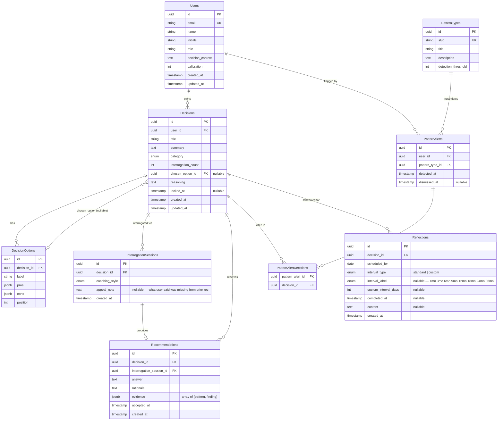

# Blindspot — Entity Relationship Diagram

---

## Enums

### `category`
`career` | `financial` | `relationship` | `health` | `education` | `housing` | `business` | `personal_growth` | `other`

### `coaching_style`
`advisor` | `supporter` | `critic`

### `interval_type`
`standard` | `custom`

### `interval_label`
`1mo` | `3mo` | `6mo` | `9mo` | `12mo` | `18mo` | `24mo` | `36mo`

---

## Key design notes

**`Decisions.chosen_option_id → DecisionOptions`**
A nullable FK that points back into the same decision's options. Deferred constraint to avoid the circular insert problem. Set only once the user commits.

**`InterrogationSessions.appeal_note`**
Stores what the user said was *missing* from the previous recommendation — not a response to a question, but free text filed before the new interrogation begins. Null on the first session for a given decision.

**`Recommendations`**
Only written when the user accepts or ends an interrogation. Never updated — if a user re-interrogates and accepts again, a new row is inserted. Query the latest by `accepted_at` to get the current standing recommendation for a decision.

**`PatternTypes`**
System-seeded rows (binary framing, external validation, career over alignment, etc.). Not user-editable. `detection_threshold` is the minimum number of matching decisions required to fire an alert.

**`PatternAlertDecisions`**
Junction table — which specific decisions contributed evidence to a given alert. Composite PK `(pattern_alert_id, decision_id)`.

**`Reflections.custom_interval_days`**
Set when `interval_type = custom`. `interval_label` is null in that case. For standard intervals, `interval_label` drives the UX display and `custom_interval_days` is null.

**`Decisions.interrogation_count`**
Incremented each time an `InterrogationSession` is created for this decision. Drives question variation (new questions, new framing on re-interrogation) without storing the prior Q&A.

**`Decisions.locked_at`**
Once set, the decision is read-only. Reflections can still be completed after lock.
